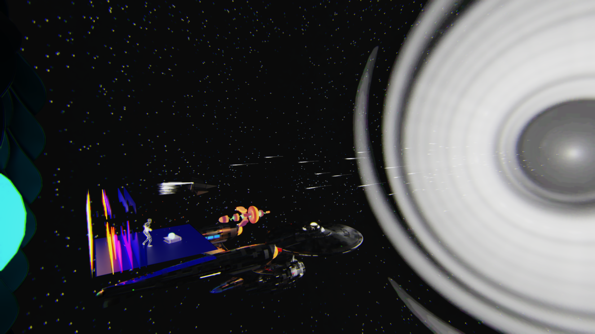

# DirectX Physically Based Raytracer

Real-time physically based rendering using GPU capable of DirectX Raytracing.

https://github.com/Hydr10n/DirectX-Physically-Based-Raytracer/assets/39995363/af8d1fe2-063d-4656-94fc-583313a63b3a

https://github.com/Hydr10n/DirectX-Physically-Based-Raytracer/assets/39995363/60782c36-6858-4d2b-a6ad-dcdb3880cf98

---

## Features
### Inline Raytracing
- Diffuse Reflection
- Specular Reflection
- Specular Transmission

### PBR Metallic/Roughness Workflow

### Skeletal Animation

### Graphics Settings
- Window Mode: Windowed | Borderless | Fullscreen
- Resolution
- HDR
- V-Sync
- NVIDIA Reflex
- Camera
	- Jitter
	- Horizontal Field of View
- Raytracing
	- Russian Roulette
	- Bounces
	- Samples per Pixel
	- NVIDIA Shader Execution Reordering
	- NVIDIA RTX Dynamic Illumination
- Post-Processing
	- NVIDIA Real-Time Denoisers
		- Denoiser: ReBLUR | ReLAX
		- Validation Overlay
	- Super Resolution: NVIDIA DLSS | Intel XeSS
	- Frame Generation: NVIDIA DLSS
	- NVIDIA Image Scaling
		- Sharpness
	- Chromatic Aberration
	- Bloom
		- Strength
	- Tone Mapping
		- HDR
			- Paper White Nits
			- Color Rotation: Rec.709 to Rec.2020 | DCI-P3-D65 to Rec.2020 | Rec.709 to DCI-P3-D65
		- Non-HDR
			- Operator: Saturate | Reinhard | ACES Filmic
			- Exposure

### Supported Input Devices
- Xbox Controller
- Keyboard
- Mouse

---

## Minimum Build Requirements
### Development Tools
- Microsoft Visual Studio 2022 (17.4)

- CMake (3.28)

- Git with LFS

- vcpkg
	```powershell
	> git clone https://github.com/Microsoft/vcpkg
	> cd vcpkg
	> .\bootstrap-vcpkg.bat
	> [Environment]::SetEnvironmentVariable("VCPKG_ROOT", $PWD.Path, [EnvironmentVariableTarget]::User)
	```

### Dependencies
- Git Submodule
	```powershell
	> git submodule update --init --recursive
	```

- Windows 11 SDK (10.0.22621.0)

## Minimum System Requirements
- OS: Microsoft Windows 10 64-bit, version 2004
- Graphics:
	- Basic: Any GPU capable of DirectX Raytracing Tier 1.1
	- NVIDIA
		- Shader Execution Reordering: GeForce RTX 40 Series
		- DLSS
			- Super Resolution: GeForce RTX 20 Series
			- Frame Generation: GeForce RTX 40 Series

---

## Showcase
- Cornell Box
<div align="center">
	
	<p>16 SPP, Denoised</p>
</div>

<br>

- [Dizzying Space Travel - "Inktober2019"](https://sketchfab.com/3d-models/24-dizzying-space-travel-inktober2019-08ee5e4cabee421ebf0b2cc927d4d6fc)
- [Abstract Core](https://sketchfab.com/3d-models/abstract-core-9f8584b1917d47f2ad14d65469b48f44)
- [U.S.S. Enterprise (ST Fan Design)](https://sketchfab.com/3d-models/uss-enterprise-st-fan-design-7dafdcf15b7c43a0bed6a5403d4a7f43)
- [Stars Dance in Galaxy](https://sketchfab.com/3d-models/stars-dance-in-galaxy-069aaa4b9dda4366b4379b551a605766)
- [Relativistic Kill Vehicle - Kurzgesagt](https://sketchfab.com/3d-models/relativistic-kill-vehicle-kurzgesagt-cd4f02c868314a5fb7c786d6df8e6773)
- [Magic Gost](https://sketchfab.com/3d-models/magic-gost-e0acec53aa504b10845f286ee68a1690)
<div align="center">
	
	<p>1 SPP, Denoised</p>
</div>
