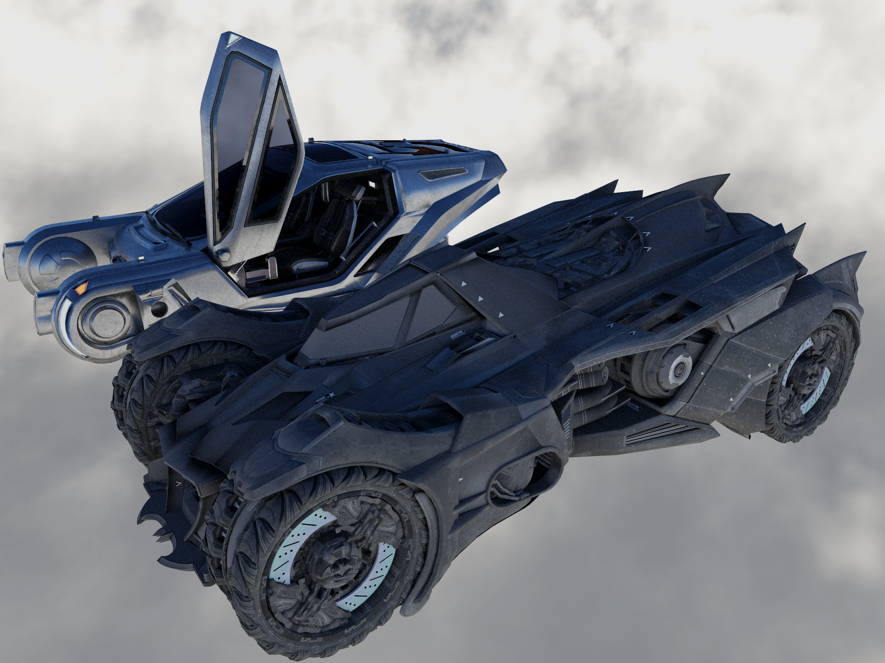
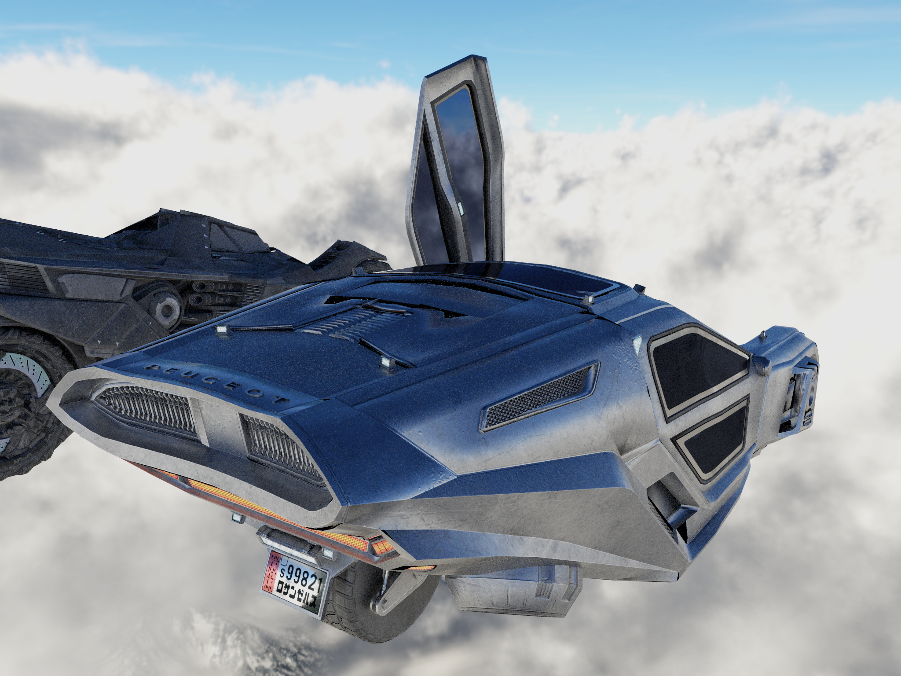
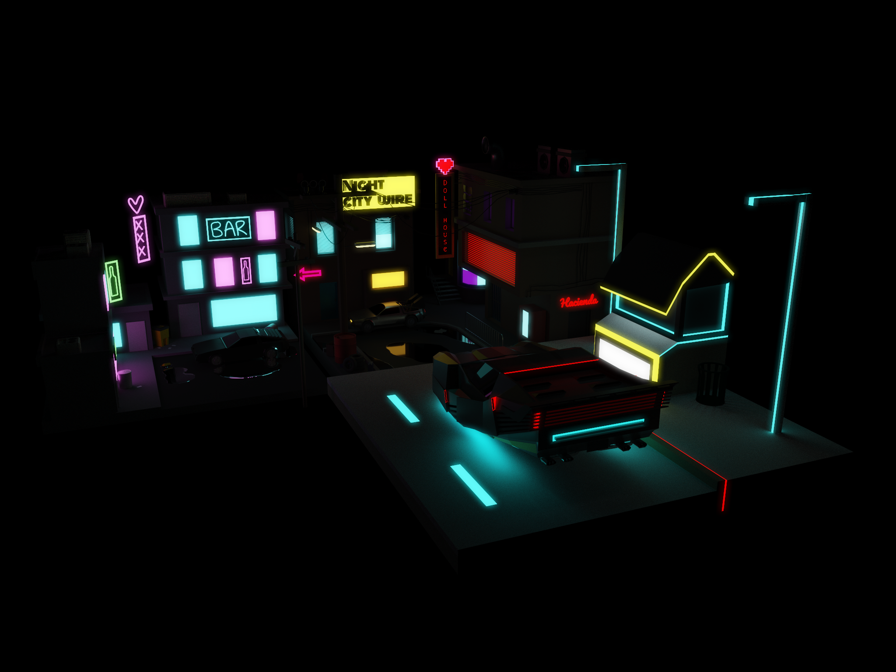

# DirectX Physically Based Raytracer

Real-time physically based rendering using GPUs capable of DirectX Raytracing.


---

## Features
### Supported Physically Based Material Attributes and Texture Map Types
- Base Color
- Emissive Color
- Specular
- Metallic
- Roughness
- Opacity

#### Other Material Attributes
- Refractive Index

#### Other Texture Map Types
- Ambient Occlusion
- Normal
- (Environment) Cube

### Model Loading

### Graphics Settings
- Window Mode: Windowed | Borderless | Fullscreen
- Resolution
- V-Sync
- Camera
	- Vertical Field of View
- Raytracing
	- Max Trace Recursion Depth
	- Samples Per Pixel
- Post-Processing
	- Tone Mapping
		- Operator: Saturate | Reinhard | ACES Filmic
		- Exposure
	- Bloom
		- Threshold
		- Blur Size

### Controls
- Xbox Controller
	|||
	|-|-|
	|Menu|Open/close menu|
	|LS (rotate)|Move|
	|LT (hold)|Move slower|
	|RT (hold)|Move faster|
	|RS (rotate)|Look around|

- Keyboard
	|||
	|-|-|
	|Alt + Enter|Toggle between windowed/borderless and fullscreen modes|
	|Esc|Open/close menu|
	|W A S D|Move|
	|Left Ctrl (hold)|Move slower|
	|Left Shift (hold)|Move faster|

- Mouse
	|||
	|-|-|
	|(Move)|Look around|

---

## Minimum Build Requirements
### Development Tools
- Microsoft Visual Studio 2022 (17.4)

- vcpkg
	```cmd
	> git clone https://github.com/Microsoft/vcpkg
	> cd vcpkg
	> .\bootstrap-vcpkg.bat
	> .\vcpkg integrate install
	```

### Dependencies
- Windows 11 SDK (10.0.22621.0)

- [DirectX Tool Kit for DirectX 12](https://github.com/Microsoft/DirectXTK12)
	```cmd
	> .\vcpkg install directxtk12:x64-windows
	```

- [Assimp](https://github.com/assimp/assimp)
	```cmd
	> .\vcpkg install assimp:x64-windows
	```

- [Dear ImGui](https://github.com/ocornut/imgui)
	```cmd
	> .\vcpkg install imgui[core,dx12-binding,win32-binding]:x64-windows
	```

- [JSON for Modern C++](https://github.com/nlohmann/json)
	```cmd
	> .\vcpkg install nlohmann-json:x64-windows
	```

## Minimum System Requirements
- OS: Microsoft Windows 10 64-bit, version 2004
- Graphics: Any GPU supporting DirectX Raytracing Tier 1.1
	- NVIDIA GeForce RTX Series
	- AMD Radeon RX 6000 Series

## Showcase










